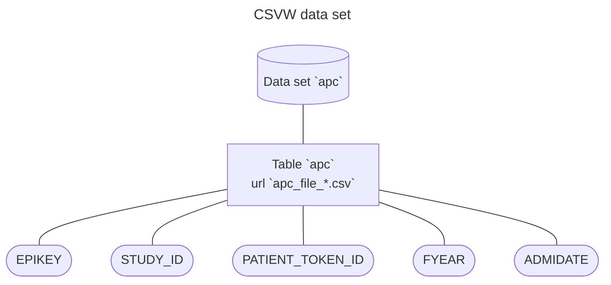

# Metadata

This directory contains descriptions of all the data sets that are involved in this project.

The metadata is written using the [CSV on the Web](https://csvw.org/) (CSVW) standard.

# Using CSVW

These are introductions to using CSVW:

* [How to make CSVW](https://csvw.org/guides/how-to-make-csvw.html)
* [CSV on the Web: A Primer](https://www.w3.org/TR/tabular-data-primer/)

These are references to specific parts of the language:

* [CSVW data models](https://w3c.github.io/csvw/syntax/#model) This section defines an annotated tabular data model.
* [CSVW data types](https://w3c.github.io/csvw/primer/#datatypes) How can you say what kinds of values are expected in a column?

## Understanding CSVW files

Each CSVW file is a [JSON document](https://www.json.org/json-en.html) where the `@context` value tells us that this is a CSVW document.

Each CSVW file describes a single *data set* or *table group*. A data set contains one or more *tables*. Each table contains multiple *columns*. An example of this for the admitted patient care (APC) data set is illustrated in the diagram below:

In a CSVW file, Each [data set (also known as a table group)](https://w3c.github.io/csvw/syntax/#table-groups) has the following keys:

- `dialect` describes the data format used in the CSV file using the [CSV Dialect standard](https://specs.frictionlessdata.io/csv-dialect/).
- `id` is the unique data set identifier e.g. "apc", "ae", "op".
- `tables` is the list of tables in this data set.

A [CSVW table](https://w3c.github.io/csvw/syntax/#tables) contains the following keys

- `id` is the unique identifier for this table.
- `notes` is a human-readable description of this table.
- `url` is a the file path of the CSV files that make up this table.
- `tableSchema` describes the structure of this table. It has the following properties:
  * [`columns`](https://w3c.github.io/csvw/syntax/#columns) are the fields in this table.

A [CSVW column](https://w3c.github.io/csvw/syntax/#columns) has the following fields:

* `name` is the field title
* `datatype` is the format of the values in this column e.g. "string", "date", etc. (See: [data types](https://w3c.github.io/csvw/syntax/#dfn-datatype))

