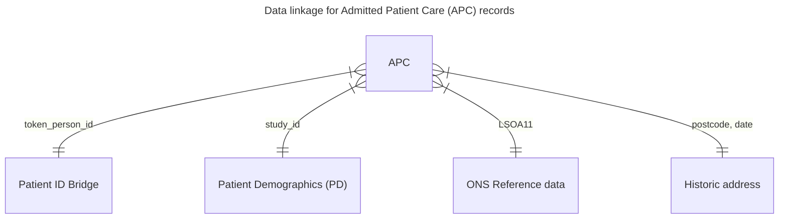

# Data linkage queries

This directory contains SQL queries that define how the data linkage will be implemented.

By default, the `linkage.sql` query will be used.

To specify a different query for a data set, create a file called `<data_set_id>.sql` and save it in this folder. For example, for specify a custom SQL query, specify `apc.sql`.

# Data model

The following diagram shows how the data sets will be linked together using an [Entity Relationship Diagram](https://mermaid.js.org/syntax/entityRelationshipDiagram.html).

