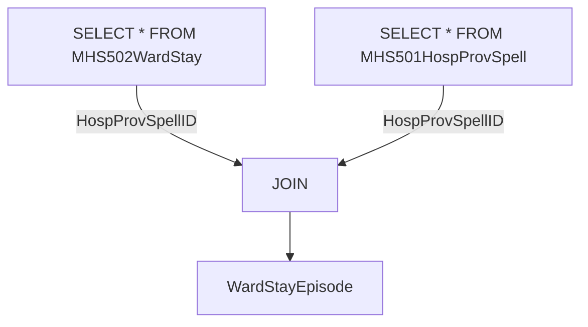
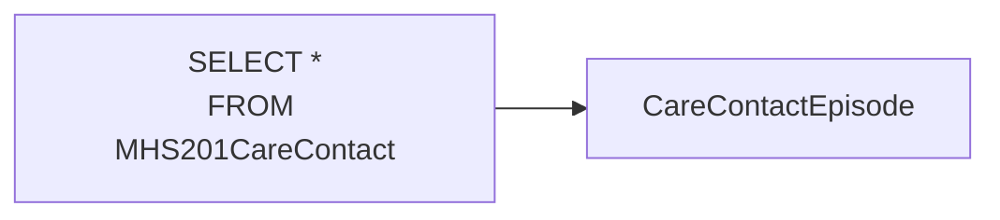
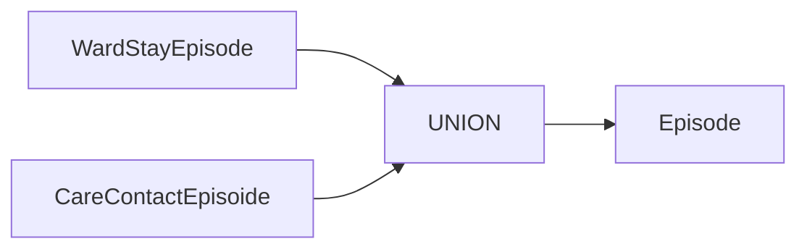

# MHSDS query

The file `mhsds.sql` contains an SQL query to demoralise the [Mental Health Services Data Set](https://digital.nhs.uk/data-and-information/data-collections-and-data-sets/data-sets/mental-health-services-data-set) (MHSDS). This is an SQL query that will convert the many tables in the MHSDS into a single table. This means merging all the tables into one wide tabular data set.

The table and field names are determined by the MHSDS v6.0 metadata, as listed in the Technical Output Specification (TOS).

# Query description

The first step is to append the Ward Stay records to the Care Contact records, to create a new object called an *Episode*, which will become the granularity of the final output data set. An episode is a record that can then join to the referral table.

In the SQL code, we use [common table expressions](https://duckdb.org/docs/sql/query_syntax/with.html) to pre-process each table using the `WITH` clause.

First we join ward stay to the hospital provider spell table, adding in columns that contain blank values. The data models for ward stay and care contact must contain the same columns, so for fields contained in one table and not the other we insert empty (`NULL` columns).

The care contact records are also prepared like this.

Next, we append the two data sets together.

-