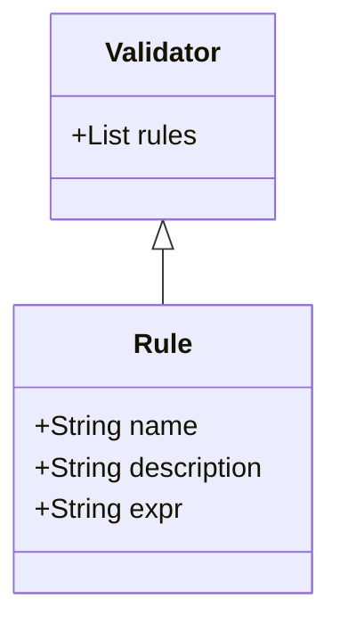

# Data validation rules

We're using the [validate](https://cran.r-project.org/web/packages/validate/index.html) R package for data validation. This defines a collection of rules that the data must conform to. To learn how to use this package, please read [*The Data Validation Cookbook*](https://cran.r-project.org/web/packages/validate/vignettes/cookbook.html) by Mark P.J. van der Loo.

## Defining rules

The files in this directory are used to define these sets of rules to be applied to check that data are valid. The files are [written in YAML format](https://cran.r-project.org/web/packages/validate/vignettes/cookbook.html#82_Metadata_in_text_files:_YAML), which is loaded by the data pipeline. There is one file per table in each data set, so the file path will have the following structure `<data_set_id>/<table_id>.yaml` for example:

```
└── validation_rules
    ├── ae
    │   └── ae.yaml
    ├── apc
    │   └── apc.yaml
    └── yas_epr
        ├── incident.yaml
        ├── observation.yaml
        └── patient.yaml
```

This structure allows us to define different data validation rules for each table in a data set.

Each rules file has the following structure, where each validator comprises a set of rules:



Each rule has a name, a description, and an expression written in the R programming language. This is an example rule for validating the `ATTENDKEY` column in the outpatient (OP) data set.

```yaml
- name: ATTENDKEY 12n 
  description: ATTENDKEY has 12 integers (2003-04 to 2020-21)
  expr: grepl("^\\d{12}$", ATTENDKEY)
```

The rule has three properties:

* `name` is a brief summary of the rule. `12n` is an NHS format as discussed below.
* `description` is a less brief explanation of the rule
* `expr` contains R code that must evaluate to a logical value (`TRUE` or `FALSE`). This example uses the `grepl` function to evaluate whether the value matches the pattern, using regular expressions as discussed below.

# NHS data formats

The data types codes, such as `10n`, are used by the [NHS Data Model and Dictionary](https://www.datadictionary.nhs.uk/). For example:

| Type | Meaning                                |
| ---- | -------------------------------------- |
| 12an | Alphanumeric string with 12 characters |
| 6n   | A number with six digits               |

# Regular expressions

Some of the validation rules use [regular expressions](https://en.wikipedia.org/wiki/Regular_expression) (regex) to perform more complex string pattern matching. This is done using the [`grepl` function](https://rdrr.io/r/base/grep.html) which returns a logical `TRUE` value if the input string matches the pattern. For example:

```R
# Match any string
x <- "My value"
pattern <- ".*"
grepl(pattern, x) # TRUE
```

There are several online tools, such as [regex101](https://regex101.com/), that may be used to help develop regex patterns. You can also ask ChatGPT to help you.

